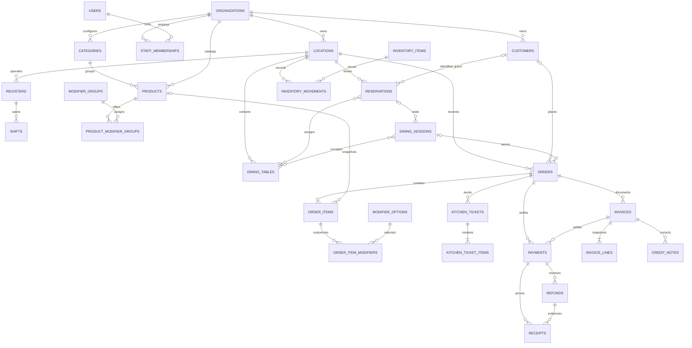
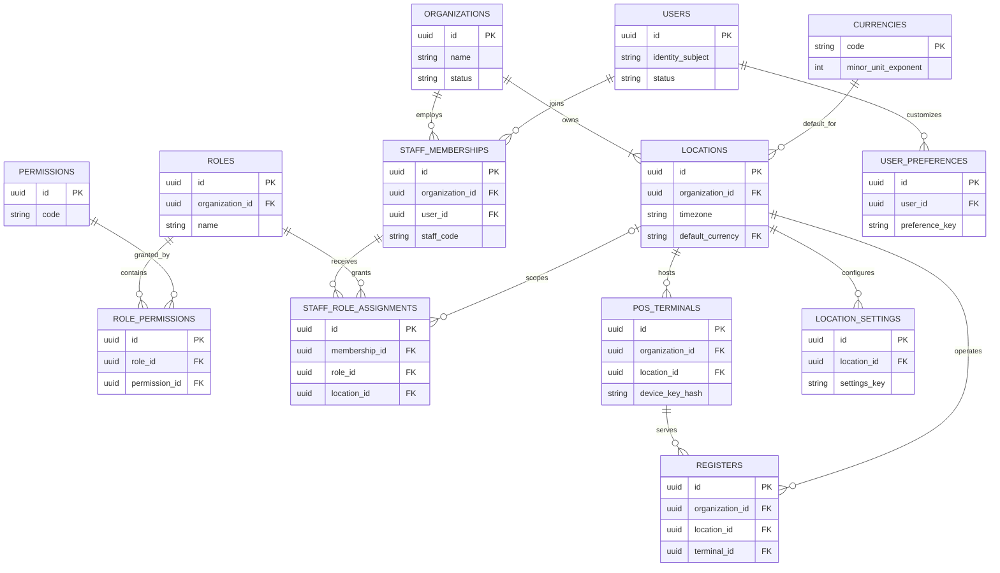
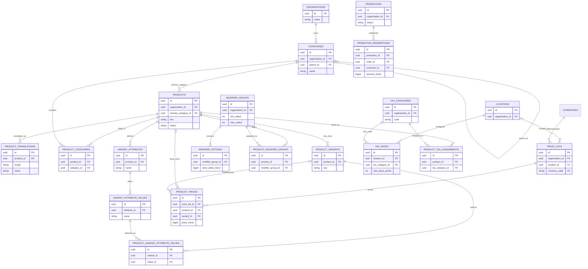
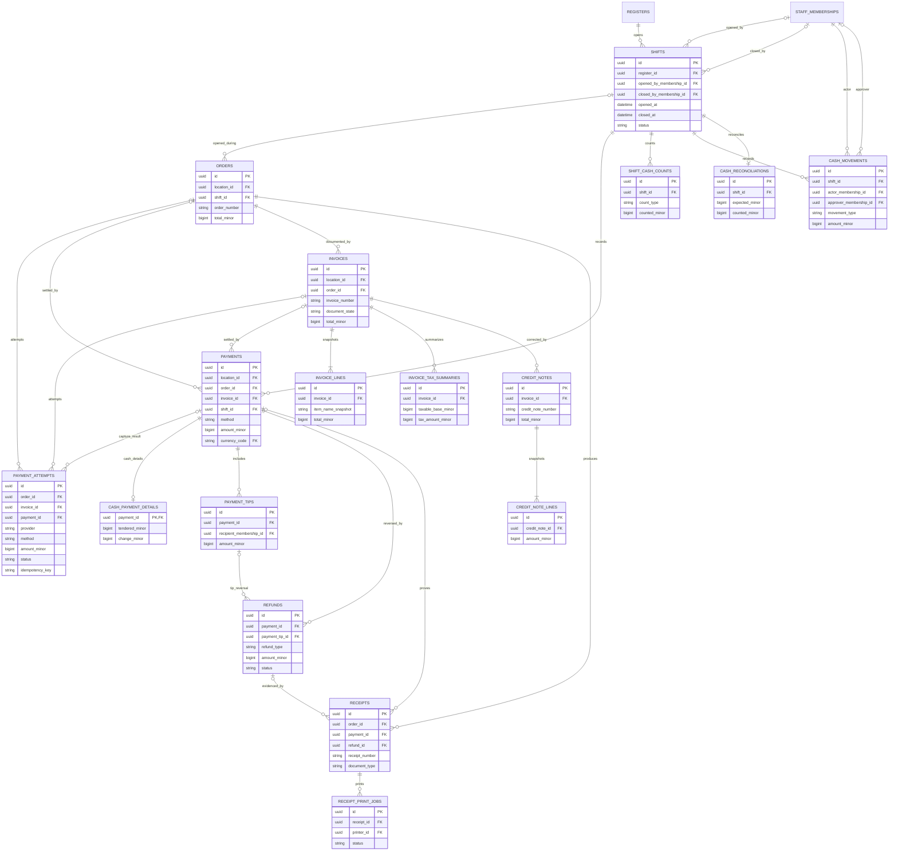

# POS Database ERD

This ERD visualizes the proposed PostgreSQL model in [pos-database-design.md](./pos-database-design.md). The diagrams are split by domain to remain readable; repeated entities such as `LOCATIONS`, `ORDERS`, and `PRODUCTS` are the same tables across diagrams.

All entities use UUID primary keys. `FK` marks a foreign key; optional foreign keys are nullable. Bridge tables also have unique constraints over their relationship columns, and every tenant-owned relationship must preserve `organization_id` integrity.

## System overview

The overview emphasizes the main service path. The domain diagrams below add the join tables, detailed money records, inventory procurement, access controls, and integration lifecycle.

## 1. Organization, staff, and catalog

## 2. Guests, dining, orders, and kitchen

```mermaid
erDiagram
  LOCATIONS {
    uuid id PK
    uuid organization_id FK
  }
  ORGANIZATIONS {
    uuid id PK
    string name
  }
  CUSTOMERS {
    uuid id PK
    uuid organization_id FK
    string display_name
  }
  CUSTOMER_CONTACTS {
    uuid id PK
    uuid customer_id FK
    string contact_type
    string value
  }
  CUSTOMER_ADDRESSES {
    uuid id PK
    uuid customer_id FK
    string address_type
  }
  CUSTOMER_TAGS {
    uuid id PK
    uuid organization_id FK
    string name
  }
  CUSTOMER_TAG_ASSIGNMENTS {
    uuid id PK
    uuid customer_id FK
    uuid tag_id FK
  }
  LOYALTY_ACCOUNTS {
    uuid id PK
    uuid customer_id FK
    string tier
  }
  LOYALTY_ENTRIES {
    uuid id PK
    uuid loyalty_account_id FK
    uuid order_id FK
    int points_delta
  }
  CUSTOMER_CREDIT_ACCOUNTS {
    uuid id PK
    uuid customer_id FK
    bigint credit_limit_minor
  }
  CUSTOMER_CREDIT_ENTRIES {
    uuid id PK
    uuid credit_account_id FK
    uuid order_id FK
    bigint amount_minor
  }
  DINING_AREAS {
    uuid id PK
    uuid location_id FK
    string name
  }
  DINING_TABLES {
    uuid id PK
    uuid location_id FK
    uuid area_id FK
    string table_code
    int capacity
  }
  RESERVATIONS {
    uuid id PK
    uuid location_id FK
    uuid customer_id FK
    string reservation_number
    datetime starts_at
    datetime ends_at
    int party_size
    string status
  }
  RESERVATION_TABLE_ASSIGNMENTS {
    uuid id PK
    uuid reservation_id FK
    uuid dining_table_id FK
    string reserved_period
    boolean blocks_availability
  }
  DINING_SESSIONS {
    uuid id PK
    uuid location_id FK
    uuid reservation_id FK
    datetime started_at
    datetime ended_at
  }
  DINING_SESSION_TABLES {
    uuid id PK
    uuid dining_session_id FK
    uuid dining_table_id FK
  }
  ORDERS {
    uuid id PK
    uuid location_id FK
    uuid customer_id FK
    uuid dining_session_id FK
    uuid shift_id FK
    string order_number
    string status
    bigint total_minor
  }
  ORDER_TABLE_ASSIGNMENTS {
    uuid id PK
    uuid order_id FK
    uuid dining_table_id FK
  }
  ORDER_ITEMS {
    uuid id PK
    uuid order_id FK
    uuid product_id FK
    uuid variant_id FK
    decimal quantity
    bigint unit_price_minor
  }
  ORDER_ITEM_MODIFIERS {
    uuid id PK
    uuid order_item_id FK
    uuid modifier_option_id FK
    bigint price_delta_minor
  }
  ORDER_DISCOUNTS {
    uuid id PK
    uuid order_id FK
    uuid order_item_id FK
    uuid promotion_id FK
    bigint amount_minor
  }
  ORDER_CHARGES {
    uuid id PK
    uuid order_id FK
    string charge_type
    bigint amount_minor
  }
  ORDER_CHARGE_TAX_LINES {
    uuid id PK
    uuid order_charge_id FK
    bigint tax_amount_minor
  }
  ORDER_ITEM_TAX_LINES {
    uuid id PK
    uuid order_item_id FK
    bigint tax_amount_minor
  }
  ORDER_EVENTS {
    uuid id PK
    uuid order_id FK
    uuid actor_membership_id FK
    string event_type
  }
  ORDER_ITEM_EVENTS {
    uuid id PK
    uuid order_item_id FK
    string event_type
  }
  ORDER_RELATIONS {
    uuid id PK
    uuid source_order_id FK
    uuid target_order_id FK
    string relation_type
  }
  ORDER_ITEM_TRANSFERS {
    uuid id PK
    uuid relation_id FK
    uuid source_item_id FK
    uuid target_item_id FK
    decimal quantity
  }
  KITCHEN_STATIONS {
    uuid id PK
    uuid location_id FK
    string name
  }
  STATION_ROUTES {
    uuid id PK
    uuid kitchen_station_id FK
    uuid product_id FK
    uuid category_id FK
  }
  KITCHEN_TICKETS {
    uuid id PK
    uuid order_id FK
    uuid kitchen_station_id FK
    string status
    datetime sent_at
  }
  KITCHEN_TICKET_ITEMS {
    uuid id PK
    uuid ticket_id FK
    uuid order_item_id FK
    decimal quantity
    string status
  }
  KITCHEN_TICKET_ITEM_EVENTS {
    uuid id PK
    uuid ticket_item_id FK
    string event_type
  }

  ORGANIZATIONS ||--o{ CUSTOMERS : owns
  CUSTOMERS ||--o{ CUSTOMER_CONTACTS : has
  CUSTOMERS ||--o{ CUSTOMER_ADDRESSES : has
  CUSTOMERS ||--o{ CUSTOMER_TAG_ASSIGNMENTS : labeled
  CUSTOMER_TAGS ||--o{ CUSTOMER_TAG_ASSIGNMENTS : applied
  CUSTOMERS ||--o| LOYALTY_ACCOUNTS : enrolls
  LOYALTY_ACCOUNTS ||--o{ LOYALTY_ENTRIES : posts
  ORDERS o|--o{ LOYALTY_ENTRIES : earns_or_redeems
  CUSTOMERS ||--o| CUSTOMER_CREDIT_ACCOUNTS : may_have
  CUSTOMER_CREDIT_ACCOUNTS ||--o{ CUSTOMER_CREDIT_ENTRIES : records
  ORDERS o|--o{ CUSTOMER_CREDIT_ENTRIES : charges_or_pays
  LOCATIONS ||--o{ DINING_AREAS : contains
  DINING_AREAS ||--|{ DINING_TABLES : contains
  LOCATIONS ||--o{ RESERVATIONS : books
  CUSTOMERS o|--o{ RESERVATIONS : identified_guest
  RESERVATIONS ||--o{ RESERVATION_TABLE_ASSIGNMENTS : assigns
  DINING_TABLES ||--o{ RESERVATION_TABLE_ASSIGNMENTS : reserved
  RESERVATIONS o|--o{ DINING_SESSIONS : becomes
  LOCATIONS ||--o{ DINING_SESSIONS : hosts
  DINING_SESSIONS ||--|{ DINING_SESSION_TABLES : occupies
  DINING_TABLES ||--o{ DINING_SESSION_TABLES : occupied_by
  LOCATIONS ||--o{ ORDERS : receives
  CUSTOMERS o|--o{ ORDERS : places
  DINING_SESSIONS o|--o{ ORDERS : serves
  ORDERS ||--o{ ORDER_TABLE_ASSIGNMENTS : assigned_to
  DINING_TABLES ||--o{ ORDER_TABLE_ASSIGNMENTS : used_by
  ORDERS ||--|{ ORDER_ITEMS : contains
  PRODUCTS o|--o{ ORDER_ITEMS : snapshots
  PRODUCT_VARIANTS o|--o{ ORDER_ITEMS : snapshots
  ORDER_ITEMS ||--o{ ORDER_ITEM_MODIFIERS : customized_with
  MODIFIER_OPTIONS o|--o{ ORDER_ITEM_MODIFIERS : selected
  ORDERS ||--o{ ORDER_DISCOUNTS : discounted
  ORDER_ITEMS o|--o{ ORDER_DISCOUNTS : line_discount
  PROMOTIONS o|--o{ ORDER_DISCOUNTS : applied
  PROMOTIONS ||--o{ PROMOTION_REDEMPTIONS : redeemed
  ORDERS ||--o{ PROMOTION_REDEMPTIONS : records
  CUSTOMERS o|--o{ PROMOTION_REDEMPTIONS : redeems
  ORDERS ||--o{ ORDER_CHARGES : charged
  ORDER_CHARGES ||--o{ ORDER_CHARGE_TAX_LINES : taxed
  ORDER_ITEMS ||--o{ ORDER_ITEM_TAX_LINES : taxed
  ORDERS ||--o{ ORDER_EVENTS : changes
  ORDER_ITEMS ||--o{ ORDER_ITEM_EVENTS : changes
  STAFF_MEMBERSHIPS ||--o{ ORDER_EVENTS : records
  ORDERS ||--o{ ORDER_RELATIONS : source_check
  ORDERS ||--o{ ORDER_RELATIONS : target_check
  ORDER_RELATIONS ||--o{ ORDER_ITEM_TRANSFERS : transfers
  ORDER_ITEMS ||--o{ ORDER_ITEM_TRANSFERS : source_line
  ORDER_ITEMS ||--o{ ORDER_ITEM_TRANSFERS : target_line
  LOCATIONS ||--o{ KITCHEN_STATIONS : configures
  KITCHEN_STATIONS ||--o{ STATION_ROUTES : routes
  PRODUCTS o|--o{ STATION_ROUTES : routes_product
  CATEGORIES o|--o{ STATION_ROUTES : routes_category
  ORDERS ||--o{ KITCHEN_TICKETS : sends
  KITCHEN_STATIONS ||--o{ KITCHEN_TICKETS : receives
  KITCHEN_TICKETS ||--|{ KITCHEN_TICKET_ITEMS : contains
  ORDER_ITEMS ||--o{ KITCHEN_TICKET_ITEMS : prepared_from
  KITCHEN_TICKET_ITEMS ||--o{ KITCHEN_TICKET_ITEM_EVENTS : transitions
```

## 3. Payments, financial documents, and shifts

Every payment and payment attempt points to exactly one order or invoice. Electronic attempts may link to their captured payment; declined attempts do not create a `PAYMENTS` row. A payment can have a cash detail row only when its method is cash.

## 4. Inventory, delivery, and platform records

```mermaid
erDiagram
  LOCATIONS {
    uuid id PK
    uuid organization_id FK
  }
  INVENTORY_ITEMS {
    uuid id PK
    uuid organization_id FK
    string name
    string stock_unit
  }
  PRODUCT_RECIPES {
    uuid id PK
    uuid product_id FK
    uuid variant_id FK
  }
  RECIPE_COMPONENTS {
    uuid id PK
    uuid recipe_id FK
    uuid inventory_item_id FK
    decimal quantity
  }
  INVENTORY_MOVEMENTS {
    uuid id PK
    uuid location_id FK
    uuid inventory_item_id FK
    decimal quantity_delta
    bigint unit_cost_minor
  }
  INVENTORY_BALANCES {
    uuid id PK
    uuid location_id FK
    uuid inventory_item_id FK
    decimal on_hand
  }
  SUPPLIERS {
    uuid id PK
    uuid organization_id FK
    string name
  }
  PURCHASE_ORDERS {
    uuid id PK
    uuid location_id FK
    uuid supplier_id FK
    string status
  }
  PURCHASE_ORDER_LINES {
    uuid id PK
    uuid purchase_order_id FK
    uuid inventory_item_id FK
    decimal ordered_quantity
  }
  GOODS_RECEIPTS {
    uuid id PK
    uuid location_id FK
    uuid purchase_order_id FK
    string status
  }
  GOODS_RECEIPT_LINES {
    uuid id PK
    uuid goods_receipt_id FK
    uuid purchase_order_line_id FK
    decimal received_quantity
  }
  STOCK_COUNTS {
    uuid id PK
    uuid location_id FK
    string status
  }
  STOCK_COUNT_LINES {
    uuid id PK
    uuid stock_count_id FK
    uuid inventory_item_id FK
    decimal counted_quantity
  }
  INTEGRATION_CONNECTIONS {
    uuid id PK
    uuid location_id FK
    string provider
    string secret_vault_reference
  }
  PRINTERS {
    uuid id PK
    uuid location_id FK
    uuid terminal_id FK
    string role
    string health_state
  }
  DELIVERY_JOBS {
    uuid id PK
    uuid order_id FK
    uuid integration_connection_id FK
    string external_order_id
    string status
  }
  DELIVERY_EVENTS {
    uuid id PK
    uuid delivery_job_id FK
    string event_type
    datetime occurred_at
  }
  DELIVERY_SETTLEMENTS {
    uuid id PK
    uuid integration_connection_id FK
    string external_settlement_id
    bigint net_amount_minor
  }
  DELIVERY_SETTLEMENT_LINES {
    uuid id PK
    uuid settlement_id FK
    uuid order_id FK
    bigint adjustment_minor
  }
  AUDIT_EVENTS {
    uuid id PK
    uuid organization_id FK
    uuid actor_membership_id FK
    string entity_type
    uuid entity_id
  }
  IDEMPOTENCY_RECORDS {
    uuid id PK
    uuid organization_id FK
    uuid terminal_id FK
    string command_id
    string request_hash
  }
  OUTBOX_EVENTS {
    uuid id PK
    uuid organization_id FK
    string aggregate_type
    uuid aggregate_id
    string event_type
    datetime created_at
  }
  DEVICE_SYNC_CURSORS {
    uuid id PK
    uuid terminal_id FK
    string server_cursor
  }
  DOCUMENT_SEQUENCES {
    uuid id PK
    uuid location_id FK
    string sequence_type
    bigint next_value
  }

  LOCATIONS ||--o{ INVENTORY_MOVEMENTS : records
  INVENTORY_ITEMS ||--o{ INVENTORY_MOVEMENTS : moves
  LOCATIONS ||--o{ INVENTORY_BALANCES : projects
  INVENTORY_ITEMS ||--o{ INVENTORY_BALANCES : balances
  PRODUCTS o|--o{ PRODUCT_RECIPES : consumes
  PRODUCT_VARIANTS o|--o{ PRODUCT_RECIPES : consumes_variant
  PRODUCT_RECIPES ||--|{ RECIPE_COMPONENTS : contains
  INVENTORY_ITEMS ||--o{ RECIPE_COMPONENTS : ingredient
  LOCATIONS ||--o{ PURCHASE_ORDERS : orders
  SUPPLIERS ||--o{ PURCHASE_ORDERS : supplies
  PURCHASE_ORDERS ||--o{ PURCHASE_ORDER_LINES : contains
  INVENTORY_ITEMS ||--o{ PURCHASE_ORDER_LINES : ordered
  PURCHASE_ORDERS o|--o{ GOODS_RECEIPTS : received_as
  GOODS_RECEIPTS ||--|{ GOODS_RECEIPT_LINES : contains
  PURCHASE_ORDER_LINES o|--o{ GOODS_RECEIPT_LINES : fulfills
  LOCATIONS ||--o{ STOCK_COUNTS : counts
  STOCK_COUNTS ||--|{ STOCK_COUNT_LINES : contains
  INVENTORY_ITEMS ||--o{ STOCK_COUNT_LINES : counted
  LOCATIONS ||--o{ INTEGRATION_CONNECTIONS : connects
  LOCATIONS ||--o{ PRINTERS : configures
  POS_TERMINALS o|--o{ PRINTERS : assigned
  ORDERS ||--o{ DELIVERY_JOBS : delivered_by
  INTEGRATION_CONNECTIONS ||--o{ DELIVERY_JOBS : dispatches
  DELIVERY_JOBS ||--o{ DELIVERY_EVENTS : changes
  INTEGRATION_CONNECTIONS ||--o{ DELIVERY_SETTLEMENTS : settles
  DELIVERY_SETTLEMENTS ||--|{ DELIVERY_SETTLEMENT_LINES : contains
  ORDERS ||--o{ DELIVERY_SETTLEMENT_LINES : reconciles
  ORGANIZATIONS ||--o{ AUDIT_EVENTS : audits
  STAFF_MEMBERSHIPS o|--o{ AUDIT_EVENTS : actor
  POS_TERMINALS ||--o{ IDEMPOTENCY_RECORDS : deduplicates
  POS_TERMINALS ||--o{ DEVICE_SYNC_CURSORS : synchronizes
  LOCATIONS ||--o{ DOCUMENT_SEQUENCES : numbers
```

`AUDIT_EVENTS.entity_type/entity_id`, `OUTBOX_EVENTS.aggregate_type/aggregate_id`, and `INVENTORY_MOVEMENTS.source_type/source_id` are intentionally polymorphic references, so they do not have direct foreign-key edges in Mermaid. The application validates those references and retains the source record instead of relying on cascading deletes.

Reservation overlap protection is enforced on assigned tables using the reserved time range and a blocking flag; see the reservation constraint in the design document. The detailed table catalog, invariants, and transaction boundaries are maintained in [pos-database-design.md](./pos-database-design.md).
